.. _Pworkflows to Pworkflows:

Workflow Implementations in Python
==================================
MIAAIM's workflows can also be run in Python to allow for more user flexibility with
custom workflow creation. To install `MIAAIM in Python
<https://github.com/JoshuaHess12/miaaim-python>`_, follow these steps:

Image Preparation (HDIprep)
^^^^^^^^^^^^^^^^^^^^^^^^^^^
The HDIprep workflow can be used in Python, just as it can be used in the
command line interface. Commands are sequentially applied to images and
are specified by the user.

Steady-state UMAP compression
-----------------------------
Here, we will run through an example of using the HDIprep workflow in MIAAIM
to create steady-state UMAP embeddings of a high-dimensional image data set. We
will be using the mass spectrometry imaging data from :code:`prototype-001`:

1. First import the necessary modules. We will also define a helper function
   to create plots after UMAP embedding.

.. code-block:: python3

   # import hdi utils module
   import hdiutils.HDIimport.hdi_reader as hdi_reader
   # import hdi_prep module
   from miaaim.hdiprep.HDIprep import hdi_prep
   # import external modules
   import matplotlib.pyplot as plt
   from sklearn.preprocessing import minmax_scale
   import matplotlib.patches as mpatches

   # create function for easy plotting
   def plot_rgb_2D(
                   embedding,
                   axs=(0,1),
                   cols=(0,1,2),
                   out_name=None
                   ):
       """
       helper function for plotting 2D scatter plots from dimension reduction method.

       axs: tuple of 2 integers indicating which axes to extract for plotting
       cols: tuple of 3 integers indicating which axes to use for RGB coloring
       out_name: name to export image as (if None, then no image exported)
       """

       # create rgb scale based off first 3 channel
       rgb=minmax_scale(embedding[:,cols])
       # extract the columns to plot
       to_plot=embedding[:, axs]

       # create manual legend items for plotting purposes
       red_patch = mpatches.Patch(color='red', label='UMAP 1')
       green_patch = mpatches.Patch(color='green', label='UMAP 2')
       blue_patch = mpatches.Patch(color='blue', label='UMAP 3')

       # scatter plot
       fig, ax = plt.subplots()
       plt.scatter(to_plot[:,0],to_plot[:,1],color=rgb,s=15,linewidths=0)
       fig.suptitle('Steady State UMAP Embedding', fontsize=12)
       plt.xlabel('UMAP {}'.format(str(axs[0]+1)), fontsize=12)
       plt.ylabel('UMAP {}'.format(str(axs[1]+1)), fontsize=12)
       plt.legend(handles=[red_patch,green_patch,blue_patch],title='Linear Scale')
       plt.savefig(out_name,dpi=400,pad_inches = 0.1,bbox_inches='tight')
       plt.close()

2. Next, we will import the data and run the steady-state UMAP embedding on the
prototype dataset.

.. code-block:: python3

   # read data with HDIutils
   mov_im = hdi_reader.HDIreader(
                       path_to_data=path_to_im,
                       path_to_markers=None,
                       flatten=True,
                       subsample=None,
                       mask=None,
                       save_mem=True
                       )
   # create data set using HDIprep module
   mov_dat = hdi_prep.IntraModalityDataset([mov_im])
   # apply steady state UMAP embedding
   mov_dat.RunOptimalUMAP(
                           dim_range=(1,11),
                           landmarks=3000,
                           export_diagnostics=True,
                           output_dir=out_path,
                           n_jobs=1
                           )

Since we chose to export diagnostic plots using :code:`export_diagnostics=True`,
we obtained a resulting image of the exponential fit to the fuzzy set cross entropy
that was used to compute the steady-state UMAP embedding:

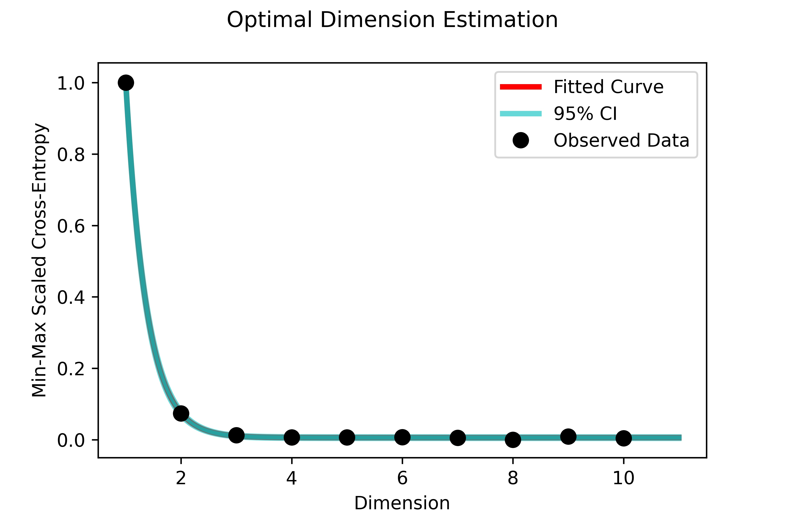

3. Now we can export a scatter plot of the 4-dimensional steady-state UMAP
   embedding in Euclidean space. Here the colors are RGB values created from the
   first 3 components of the embedding:

.. code-block:: python3

   # for plotting purposes, extract the key of the umap embedding
   key = list(mov_dat.umap_embeddings.keys())[0]
   # plot the embedding of the UMAP in Euclidean space
   embed = mov_dat.umap_embeddings[key]
   # export a plot of the results in Euclidean space
   plot_rgb_2D(embed.values, out_name="steady-state-UMAP-prototype-001.jpeg")

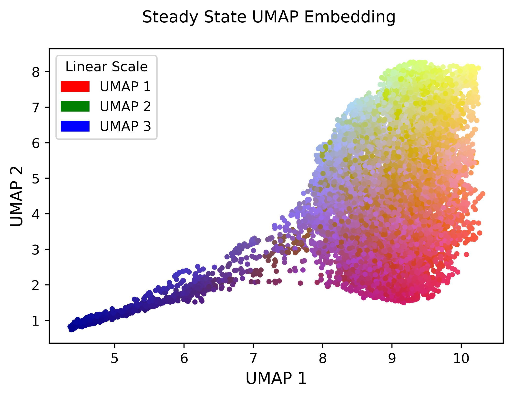

4. A final step to process prototype-001 is to reconstruct the original raster
   object using the coordinates of each pixel. Since the
   image was not a rectangular array, we will map it back to the spatial domain
   using the :code:`method="coordinate"` option for the :code:`SpatiallyMapUMAP` function.

.. tip::
   Running steady-state image processing on data that is stored an array
   format follows the same process here, except the spatial mapping with
   :code:`SpatiallyMapUMAP` uses the :code:`method="rectangular"` option.

.. code-block:: python3

   # reconstruct spatial image from UMAP embedding
   mov_dat.SpatiallyMapUMAP(method="coordinate")
   # extract processed image
   proc_im = mov_dat.set_dict[key].hdi.data.processed_image
   #plot the image using matplotlib (only the first 3 channels using RGB scale)
   plt.imshow(proc_im[:,:,(0,1,2)])

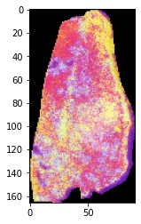

5. The last step is to export the image for subsequent registration to its H&E
   stained counterpart. Here we export the image with padding and image resizing
   and view the results:

.. code-block:: python3

   # export the processed image to the nifti format for image registration
   # here we pad the image and resize it using bilinear interpolation for
   # registration with the corresponding H&E image.
   mov_dat.ExportNifti1(
                       output_dir="/Users/joshuahess/Desktop/",
                       padding="(20,20)",
                       target_size="(2472,1572)"
                       )
   # load the exported image and view
   exported = hdi_reader.HDIreader(
                       path_to_data="/Users/joshuahess/Desktop/prostate_processed.nii",
                       path_to_markers=None,
                       flatten=False,
                       subsample=None,
                       mask=None,
                       save_mem=False
                       )
   # plot the exported image
   plt.imshow(exported.hdi.data.image[:,:,(0,1,2)])

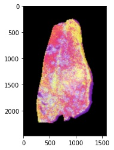

Histological Image Processing
-----------------------------
Here we will demonstrate an example of running histology image processing on the
H&E imaging modality. We will be using the prostate H&E imaging data from
:code:`prototype-001` in the MIAAIM software.

1. First import the necessary modules.

.. code-block:: python3

   # import hdi utils module
   import hdiutils.HDIimport.hdi_reader as hdi_reader
   # import hdi_prep module
   from miaaim.hdiprep.HDIprep import hdi_prep
   # import external modules
   import matplotlib.pyplot as plt
   import os

2. Now we will set the path to our imaging data and the output folders, and we will
read in the imaging data set using the :code:`HDIreader` class from the :code:`hdi-utils`
python package. We will then create a dataset using the :code:`HDIprep` module
imported above.

.. code-block:: python3

   # set the path to the imaging data
   path_to_im = "/Users/joshuahess/Desktop/prototype-001/input/fixed"
   # set the path to the output directory
   out_path = "/Users/joshuahess/Desktop/prototype-001/notebook-output"

   # read data with HDIutils
   fix_im = hdi_reader.HDIreader(
                    path_to_data=path_to_im,
                    path_to_markers=None,
                    flatten=False,
                    subsample=None,
                    mask=True,
                    save_mem=False
                    )
   # create data set using HDIprep module
   fix_dat = hdi_prep.IntraModalityDataset([fix_im])
   # for plotting purposes, extract the key of the data set
   key = list(fix_dat.set_dict.keys())[0]

3. Now use the :code:`IntramodalityDataset` class to run sequential morphological
operations. Here we will show the input H&E image along with the manually drawn
mask that we will use to help our image processing pipeline.

.. note::

   All data are stored in the :code:`IntramodalityDataset` as dictionary objects,
   kept under their filename as the key.

.. code-block:: python3

   # plot the histology image
   plt.imshow(fix_dat.set_dict[key].hdi.data.image)

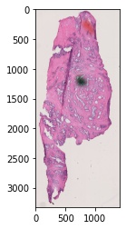

.. code-block:: python3

   # plot the input manually drawn mask in ImageJ
   plt.imshow(fix_dat.set_dict[key].hdi.data.mask.toarray(),cmap='gray')

4. Next, we will convert the image to grayscale (carried out automatically in
the :code:`MedianFilter` function) and will use a median filter to remove salt and
pepper noise in the image prior to the thresholding process.

.. code-block:: python3

   # apply sequential processing steps
   # remove salt and pepper noise
   fix_dat.MedianFilter(filter_size=25,parallel=False)
   # extract the procesed image to show
   plt.imshow(fix_dat.set_dict[key].hdi.data.processed_image,cmap='gray')

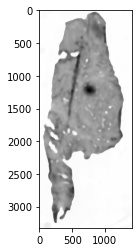

5. After filtering, we will use the :code:`otsu` automatic thresholding method to convert
the grayscale image into a binary mask separating foreground from background.

.. code-block:: python3

   # create mask with thresholding
   fix_dat.Threshold(type='otsu')
   # extract the procesed image to show
   plt.imshow(fix_dat.set_dict[key].hdi.data.processed_image.toarray(),cmap='gray')

6. After thresholding, we will perform a series of morphological operations on the
mask to smooth edges, fill holes, and connect regions in the mask that should
represent the foreground (where the tissue is).

.. code-block:: python3

   # morphological opening
   fix_dat.Open(disk_size=20,parallel=False)
   # extract the procesed image to show
   plt.imshow(fix_dat.set_dict[key].hdi.data.processed_image.toarray(),cmap='gray')

.. code-block:: python3

   # morphological closing
   fix_dat.Close(disk_size=40,parallel=False)
   # extract the procesed image to show
   plt.imshow(fix_dat.set_dict[key].hdi.data.processed_image.toarray(),cmap='gray')

.. code-block:: python3

   # morphological fill
   fix_dat.Fill()
   # extract the procesed image to show
   plt.imshow(fix_dat.set_dict[key].hdi.data.processed_image.toarray(),cmap='gray')

.. code-block:: python3

   # morphological opening
   fix_dat.Open(disk_size=15,parallel=False)
   # extract the processed image to show
   plt.imshow(fix_dat.set_dict[key].hdi.data.processed_image.toarray(),cmap='gray')

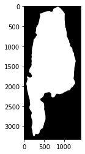

.. code-block:: python3

   # apply the manual input mask (will act on the previous masks)
   fix_dat.ApplyManualMask()
   # extract the processed image to show
   plt.imshow(fix_dat.set_dict[key].hdi.data.processed_image.toarray(),cmap='gray')

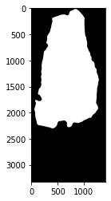

.. code-block:: python3

   # extract bounding box in the image for constant padding
   fix_dat.NonzeroBox()
   # extract the processed image to show
   plt.imshow(fix_dat.set_dict[key].hdi.data.processed_image.toarray(),cmap='gray')

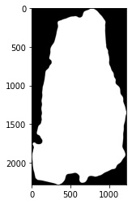

.. code-block:: python3

   # apply the final mask after all operations
   fix_dat.ApplyMask()
   # extract the processed image to show
   plt.imshow(fix_dat.set_dict[key].hdi.data.processed_image)

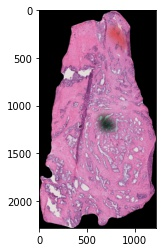

7. We will now add padding to the edges of the image to register this image
to our mass spectrometry imaging data set. We recommend being a little generous
with how much padding you add -- leaving too little room on the edges of your
image may make the registration optimization more difficult.

We will export the image with padding and read it back into our session to
view the results:

.. code-block:: python3

   # export the processed image to the nifti format for image registration
   # here we pad the image for registration with the corresponding MSI
   # compressed image.
   fix_dat.ExportNifti1(
                       output_dir=out_path,
                       padding="(150,150)",
                       target_size=None
                       )

   # load the exported image and view
   exported = hdi_reader.HDIreader(
                       path_to_data=os.path.join(out_path,"fixed_processed.nii"),
                       path_to_markers=None,
                       flatten=False,
                       subsample=None,
                       mask=None,
                       save_mem=False
                       )
   # plot the exported image
   plt.imshow(exported.hdi.data.image)

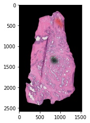

Image Registration (HDIreg)
^^^^^^^^^^^^^^^^^^^^^^^^^^^
The HDIreg workflow in Python is split into two modules, just as it is in
Nextflow -- the :code:`elastix` and :code:`transformix` workflows. Here, we will
show both of them on the same data -- :code:`prototype-001`.

elastix
-------

1. First import the necessary modules.

.. code-block:: python3

   # import hdi utils module
   import hdiutils.HDIimport.hdi_reader as hdi_reader
   # import elastix and transformix modules
   from miaaim.hdiprep.HDIprep import hdi_prep
   from miaaim.hdireg.HDIreg import elastix
   from miaaim.hdireg.HDIreg import transformix
   # import external modules
   import matplotlib.pyplot as plt
   import os

2. Now we will set the path to our processed imaging data and the output folder,
and we will read in the imaging data set using the :code:`HDIreader` class from
the :code:`hdi-utils` python package. We will then create a dataset using the
:code:`HDIprep` module imported above. We will set the path to both the fixed
image (the H&E modality) and a moving image (the steady-state UMAP compressed image).

.. note::

   You do not need to import these modules to run :code:`elastix` and
   :code:`transformix` from the :code:`hdi-reg` module. We are importing them
   so that we can easily plot the results of the registration process.

.. code-block:: python3

   # set the path to the processed imaging data from hdiprep modules
   path_to_fixed = r"D:\Josh_Hess\prototype-001\notebook-output\fixed_processed.nii"
   path_to_moving = r"D:\Josh_Hess\prototype-001\notebook-output\moving_processed.nii"
   # set the path to the output directory
   out_dir = r"D:\Josh_Hess\prototype-001\notebook-output"

   # read data with HDIutils
   fix_im = hdi_reader.HDIreader(
                       path_to_data=path_to_fixed,
                       path_to_markers=None,
                       flatten=False,
                       subsample=None,
                       mask=False,
                       save_mem=False
                       )
   # create data set using HDIprep module
   fix_dat = hdi_prep.IntraModalityDataset([fix_im])
   # for plotting purposes, extract the key of the data set
   fix_key = list(fix_dat.set_dict.keys())[0]

   # read data with HDIutils
   mov_im = hdi_reader.HDIreader(
                       path_to_data=path_to_moving,
                       path_to_markers=None,
                       flatten=False,
                       subsample=None,
                       mask=False,
                       save_mem=False
                       )
   # create data set using HDIprep module
   mov_dat = hdi_prep.IntraModalityDataset([mov_im])
   # for plotting purposes, extract the key of the data set
   mov_key = list(mov_dat.set_dict.keys())[0]

   # plot the histology image
   plt.imshow(fix_dat.set_dict[fix_key].hdi.data.image)

.. code-block:: python3

   # plot the moving steady state UMAP compressed image (note that we are only showing
   # the first three channels in RGB space)
   plt.imshow(mov_dat.set_dict[mov_key].hdi.data.image[:,:,:3])

3. Next, we will register these two images using the :code:`HDIreg` workflow
and the manifold alignment scheme. We will do this by first registering the
images using an affine transformation, and then the images will be registered
nonlinearly. These are indicated in the input folder of :code:`prototype-001`
by the :code:`affine.txt` and :code:`nonlinear.txt` parameter files.

First, we set the paths to our parameter files and create a list from the two.

.. note::

   Elastix uses file paths as input rather than any objects from the :code:`HDIprep`
   module.

.. code-block:: python3

   # set path to affine registration parameters
   affine_pars = r"D:\Josh_Hess\prototype-001\input\affine_short.txt"
   # set path to affine registration parameters
   nonlinear_pars = r"D:\Josh_Hess\prototype-001\input\nonlinear_short.txt"
   # concatenate the two parameter files to a list
   p = [affine_pars, nonlinear_pars]

4. Now we can register the images using the :code:`elastix` module.

.. note::

   There are two pairs of elastix registration parameter files in the
   :code:`input` folder for :code:`prototype-001`. Here we use the shorter
   version for registration. The original version took ~1 hour to complete.
   The short version took ~40min using this dataset. If you are not using a
   machine with a lot of computing power, consider using the short version,
   as shown here. The short version was created by changing the number of
   resolutions and the number of spatial samples in the registration parameter files.

.. code-block:: python3

   # run the registration
   elastix.Elastix(path_to_fixed,
                   path_to_moving,
                   out_dir,
                   p,
                   fp=None,
                   mp=None,
                   fMask=None
                   )

In the nonlinear parameter file, :code:`nonlinear.txt`, we chose to export a r
esulting image from elastix after registration using the :code:`WriteResultImage`
option. The output of this registration will be labelled with the suffix :code:`.1`
since it is the second registration (the first registration would have
exported an image with the :code:`.0` suffix).

5. We can check the registration results by loading the images into ImageJ/FIJI.
Here we exported an overlay of one of the H&E images and the resulting image from elastix.
We saved the file as :code:`elastix-fiji-stack.tif`. The cyan channel is the
H&E modality, and the magenta channel is a channel from the MSI steady state compressed image.

.. note::

   Elastix will only export the first channel if you using the
   :code:`WriteResultImage` option. The full image stack can be exported using
   transformix, which we will show in a moment.

.. code-block:: python3

   # set path to output image
   result_path = r"D:\Josh_Hess\prototype-001\notebook-output\elastix-fiji-stack.tif"
   # read the output image stack for registration results
   result = hdi_reader.HDIreader(
                       path_to_data=result_path,
                       path_to_markers=None,
                       flatten=False,
                       subsample=None,
                       mask=False,
                       save_mem=False
                       )
   # create data set using HDIprep module
   result_dat = hdi_prep.IntraModalityDataset([result])
   # for plotting purposes, extract the key of the data set
   result_key = list(result_dat.set_dict.keys())[0]

   # plot the histology image
   plt.imshow(result_dat.set_dict[result_key].hdi.data.image)

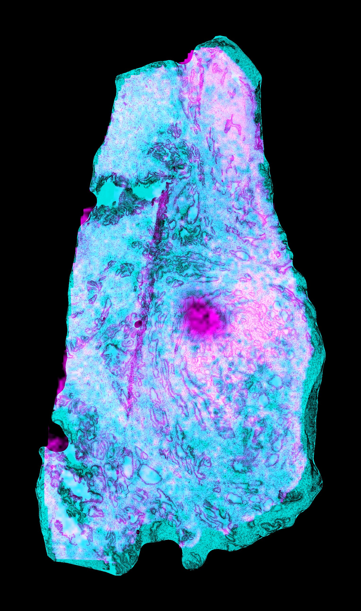

transformix
-----------
6. Now, we can transform the original moving image using the elastix registration
transform parameters. These are stored as :code:`TransformParameters.0.txt`
and :code:`TransformParameters.1.txt`, again numbered according to the
registration used (affine vs. nonlinear).

We set the path to the image registration parameters, the original moving image,
and we set the pad width and target image size that were used during the :code:`HDIprep`
module (see notebook 001). All padding and image resizing is carried out on a
per channel basis in :code:`Transformix`.

.. note::

   Note that running transformix on prototype-001 took ~8min on this machine,
   transformix 191 channels from the MSI data. The resulting file,
   :code:`moving_result.nii`, is stored here as a :code:`.nii` stack, and is ~5.86 GB.

.. code-block:: python3

   # set path to moving image
   in_im = r"D:\Josh_Hess\prototype-001\input\moving"
   # set path to output transform parameter files
   tps = [r"D:\Josh_Hess\prototype-001\notebook-output\TransformParameters.0.txt",
           r"D:\Josh_Hess\prototype-001\notebook-output\TransformParameters.1.txt"]
   # set target size and padding (see notebook 001 for details)
   target_size = (2472,1572)
   pad = (20,20)

   # transform the set of MSI data
   transformix.Transformix(in_im,
                           out_dir,
                           tps,
                           target_size,
                           pad,
                           trim = None,
                           crops = None,
                           out_ext = ".nii"
                           )

Tissue State Modeling (PatchMAP)
^^^^^^^^^^^^^^^^^^^^^^^^^^^^^^^^
Here, we will show how to stitch together data by demonstrating cobordism learning
in the PatchMAP workflow with the digits dataset.

1. First import the necessary modules.

.. code-block:: python3

   # import patchmap module
   from miaaim.patchmap import patchmap_
   from miaaim.patchmap import utils
   # import external modules
   import scipy.sparse
   from sklearn.datasets import load_digits
   import matplotlib
   import pandas as pd
   import numpy as np
   import matplotlib.pyplot as plt
   import os

2. Now we will we will read in the example data from the digits dataset.
We will then cut each individual digit into its own data frame to feed as input
to the   :code:`compute_cobordism` function of the :code:`patchmap` workflow.

.. code-block:: python3

   # Load digits data
   digits = load_digits()
   dat = pd.DataFrame(digits['data'])
   # Get the factor manifold IDs
   nms = pd.DataFrame(digits['target'],columns=["target"])
   # Create a combined data frame with names and data
   dat_pd = pd.concat([dat,nms],axis=1)

   # Create a list to store all digits in
   digits_pd_list = []
   digits_np_list = []
   # Iterate through digits and create datafames for stitiching
   for i in range(0,10):
       # Hold out digit i
       tmp = dat_pd.loc[dat_pd["target"]==i]
       # Update the pandas list
       digits_pd_list.append(tmp)
       # Update the numpy list
       digits_np_list.append(tmp.iloc[:,:64].values)

   # Concatenate the lists
   pandas_digits = pd.concat(digits_pd_list)
   np_digits = np.vstack(digits_np_list)
   # Create a colormap for the chosen labels
   cmap = utils.discrete_cmap(len(pandas_digits['target'].unique()), 'tab20_r')
   # Create colors
   colors = [cmap(i) for i in pandas_digits['target']]

3. Now use the :code:`compute_cobordism` function to create a higher-dimensional manifold
that models similarity between each of the digits in the dataset.

.. code-block:: python3

   # set number of nearest neighbors
   nn = 150
   # run the simiplicial set patching
   patched_simplicial_set = patchmap_.compute_cobordism(
                                       digits_np_list,
                                       n_neighbors = nn
                                       )

4. Now embed the cobordism into two-dimensional space for visualization.

.. code-block:: python3

   # embed the data
   out = patchmap_.embed_cobordism(
                                   digits_np_list,
                                   patched_simplicial_set,
                                   2,
                                   n_epochs=200,
                                   random_state=2,
                                   min_dist = 0.1
                                   )

   # plot the results of embedded data
   plt.rcParams['axes.linewidth'] = 1.5
   fig, ax = plt.subplots(figsize=[6.5, 5.5])
   im = ax.scatter(out[:,0], out[:,1], c = colors, s=50,cmap=cmap, edgecolor='white',linewidths=0.2)

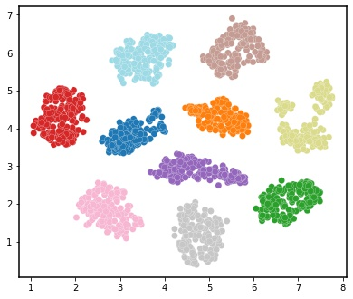

Cross-System/Tissue Information Transfer (i-PatchMAP)
^^^^^^^^^^^^^^^^^^^^^^^^^^^^^^^^^^^^^^^^^^^^^^^^^^^^^
