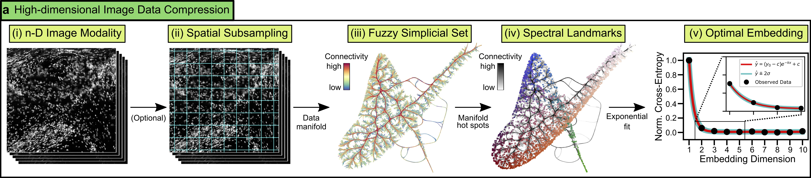
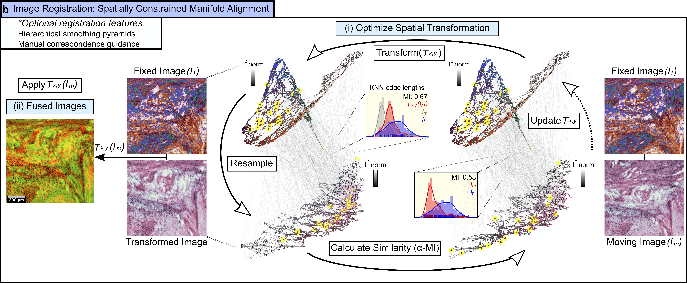
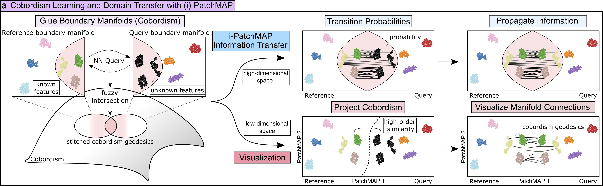

.. _Workflows to Workflows:

Workflows
=========

MIAAIM contains 4 major workflows:

1. High-Dimensional Image Preparation with the
:ref:`HDIprep workflow <HDIprep to HDIprep>`

2. High-Dimensional Image Registration with the
:ref:`HDIreg workflow <HDIreg to HDIreg>`

3. Tissue state modelling with the
:ref:`PatchMAP workflow <PatchMAP to PatchMAP>` and

4. Cross-system/tissue information transfer with the
:ref:`i-PatchMAP workflow <i-PatchMAP to i-PatchMAP>`.

For a comprehensive table of input options for these workflows, see the
:ref:`Parameter Reference <Parameter Reference to Parameter Reference>` section.
Up-to-date input options and docker containerized versions of each workflow
are available on GitHub:

.. _Workflow GitHub Repositories to Workflow GitHub Repositories:
.. list-table:: Workflow GitHub Repositories
   :widths: 25 25
   :header-rows: 1

   * - Workflow
     - Resource
   * - hdiprep
     - https://github.com/JoshuaHess12/hdi-prep
   * - hdireg
     - https://github.com/JoshuaHess12/hdi-reg
   * - patchmap/i-patchmap
     - https://github.com/JoshuaHess12/patchmap

.. _HDIprep to HDIprep:

Image Preparation (HDIprep)
^^^^^^^^^^^^^^^^^^^^^^^^^^^
Image preparation begins the workflow for MIAAIM, and it is designed to provide
processed images to the HDIreg image registration workflow. HDIprep can process
high-parameter images as well as histological stains.

HDIprep works by chaining together multiple operations in sequence to process images.
Each operation is indicated as an argument in a YAML parameter file that is passed
to the HDIprep workflow.

.. tip::
    If your images have more than 3 channels, you should apply
    HDIprep as indicated in the
    :ref:`High Dimensional Image Processing <High Dimensional Input to High Dimensional Input>`
    section. If your images have 3 or less channels, you should apply HDIprep as
    indicated in the :ref:`Histological Image Processing <Histological Input to Histological Input>`
    section.

.. warning::
    All HDIprep parameter files should end with the :code:`ExportNifti1` function
    so that an output is produced!

YAML Parameter File Input Basics
--------------------------------
HDIprep parses YAML parameter files as Python would. Input to the HDIprep workflow
requires two sections to be completed in YAML parameter files for both a fixed
image, which will remain unmoved during image registration, and a moving image,
which will be transformed. The sections that must be completed are the :code:`ProcessingSteps`
and :code:`InputOptions` sections. Below is an example parameter file for
image compression with HDIprep:

::

    ImportOptions:                                 # indicates import options
      flatten: True                                # flatten the image for dimension reduction
      subsample: True                              # subsample pixels
      method: 'grid'                               # method to use for subsampling
      grid_spacing: (5,5)                          # subsampling grid spacing

    ProcessingSteps:                               # indicates processing steps
      - RunOptimalUMAP:                            # steady state UMAP compression
          n_neighbors: 15                          # nearest neighbors for UMAP
          metric: 'euclidean'                      # metric for UMAP
          random_state: 1221                       # random state for UMAP reproducibility
      - SpatiallyMapUMAP                           # spatial reconstruction of UMAP embedding
      - ExportNifti1                               # export processed image as NIfTI

1. :code:`ImportOptions` parameters are indicated as key-value pairs
with a colon (:code:`:`) For example,
the above snippet will import high-dimensional image data, it will flatten it
into an array with the :code:`flatten: True`, subsample the flattened array with
:code:`subsample: True` using a uniformly spaced grid with grid spacing of 5 pixels.

2. :code:`ProcessingSteps` in HDIprep are indicated
with the :code:`-` flag. These steps will be run sequentially. Parameters within each
processing step are indicated as key-value pairs with a colon (:code:`:`) For example,
the above snippet will run steady state UMAP compression using the :code:`RunOptimalUMAP`
function with the given :code:`n_neighbors`, :code:`metric`, and :code:`random_state` parameters
specified.
Then, pixels in the UMAP embedding will be mapped to their respective spatial location
on the tissue with using the :code:`SpatiallyMapUMAP` function. This reconstructed
UMAP compressed image will then be
exported as an image with the :code:`ExportNifti1` function.

.. note::
    MIAAIM expects the NIfTI format (:code:`.nii` suffix) as input for the HDIreg
    workflow. HDIprep therefore
    exports processed images using the :code:`ExportNifti1`
    function. NIfTI provides memory-mapping capabilities within Python
    that save RAM in HDIreg. However, OME-TIF, HDF5, imzML, and NIfTI can be used as input
    formats for HDIprep!

.. _High Dimensional Input to High Dimensional Input:

High-Parameter Image Processing
-------------------------------

MIAAIM processes high-parameter images using a newly developed image
compression method. This method is based off of UMAP. The HDIprep workflow adds functionality
to subsample images for rapid UMAP compression, and it can embed data in
a dimensionality that preserves data information while minimizing the
necessary dimensionality of the embedding space (number of channels in the
compressed image).

Implementing this new compression method is indicated in the HDIprep YAML parameter
file under :code:`ProcessingSteps` as :code:`RunOptimalUMAP`. After an embedding
is created with :code:`RunOptimalUMAP`, map the pixels back to their spatial location
with :code:`SpatiallyMapUMAP`.

.. note::
    The HDIprep workflow can also apply a neural network variant of UMAP to
    scale to very large images. Implement this version by using the function
    :code:`RunOptimalParametricUMAP`.

.. tip::
    The HDIprep workflow can accept a mask in the TIFF format to focus dimension
    reduction on a region of interest on a larger section. This could be useful
    for very large noisy images. Use this feature by specifying
    :code:`mask: True` under :code:`ImportOptions`. Make sure the mask is
    in the input directory with your image data and be sure to name it with your
    image's name followed by the suffix :code:`-mask`. For example, the mask associated
    with a a moving image named :code:`moving.nii` should be named :code:`moving-mask.tif`.
    See this in action below:

    .. figure:: images/input-mask-folder-example.png
       :width: 100%

.. _Histological Input to Histological Input:

Histological Image Processing
-----------------------------
MIAAIM supports parallelized image smoothing and morphological operations, such
as thresholding to create masks, opening, closing, and filling for histological
image preprocessing. These are typically applied as sequential image processing
options.

HDIprep Implementation Guide
----------------------------
.. list-table:: HDIprep Implementation Guide
   :widths: 25 25
   :header-rows: 1

   * - Image Data Type
     - Suggested HDIprep YAML File Contents
   * - High-Dimensional (>3 channels)
     - ::

         ImportOptions:
           flatten: True
           subsample: True
           method: 'grid'
           grid_spacing: (3,3)

         ProcessingSteps:
           - RunOptimalUMAP:
               n_neighbors: 15
               metric: 'euclidean'
               landmarks: 3000
               dim_range: (1,10)
               random_state: 1221
           - SpatiallyMapUMAP
           - ExportNifti1
   * - Low-Dimensional (<=3 channels)
     - ::

         ImportOptions:
           flatten: False
           subsample: None
           mask: True        # True if you have a custom input mask, otherwise set to False
         ProcessingSteps:
           - RunOptimalUMAP:
               n_neighbors: 15
               metric: 'euclidean'
               landmarks: 3000
               dim_range: (1,10)
               random_state: 1221
           - SpatiallyMapUMAP
           - ExportNifti1

         ProcessingSteps:
           - MedianFilter:
               filter_size: 25   # median filtering
               parallel: True
           - Threshold:
               type: 'otsu'      # create mask with thresholding
           - Open:
               disk_size: 20     # morphological opening
               parallel: True
           - Close:
               disk_size: 40     # morphological closing
               parallel: True
           - Fill                # fill holes in mask
           - Open:
               disk_size: 15     # morphological opening
               parallel: True
           - ApplyManualMask     # apply manual input mask
           - NonzeroBox          # perform nonzero slicing for constant padding
           - ApplyMask
             - ExportNifti1      # export as nifti

.. note::
    The above processing steps are based on histological images scaled to a
    resolution of ~1.2 micron/pixel.

.. _HDIreg to HDIreg:

Image Registration (HDIreg)
^^^^^^^^^^^^^^^^^^^^^^^^^^^

Image registration in MIAAIM is performed in the HDIreg workflow.
Like the HDIprep workflow, HDIreg can process
high-parameter images as well as histological stains.

HDIreg works by supplying an Elastix parameter file in a pairwise registration
procedure between a fixed image (reference image), and a moving image.

.. tip::
    If your images have more than 3 channels, you should apply
    HDIprep as indicated in the
    :ref:`High Dimensional Image Processing <High Dimensional Input to High Dimensional Input>`
    section. If your images have 3 or less channels, you should apply HDIprep as
    indicated in the :ref:`Histological Image Processing <Histological Input to Histological Input>`
    section.

.. warning::
    All HDIprep parameter files should end with the :code:`ExportNifti1` function
    so that an output is produced!

HDIreg Implementation Guide
---------------------------
.. list-table:: HDIreg Implementation Guide
    :widths: 25 25
    :header-rows: 1

    * - Image Data Type
      - Suggested HDIreg Elastix Text File Contents
    * - Mixed High (>3) and Low (<= 3 channels) Dimensional Images
      - test
    * - High (>3 channels) Dimensional Images
      - test
    * - Low (<=3 channels) Dimensional Images
      - test

.. _PatchMAP to PatchMAP:

Tissue State Modelling (PatchMAP)
^^^^^^^^^^^^^^^^^^^^^^^^^^^^^^^^^

.. _i-PatchMAP to i-PatchMAP:

Cross-System/Tissue Information Transfer (i-PatchMAP)
^^^^^^^^^^^^^^^^^^^^^^^^^^^^^^^^^^^^^^^^^^^^^^^^^^^^^
